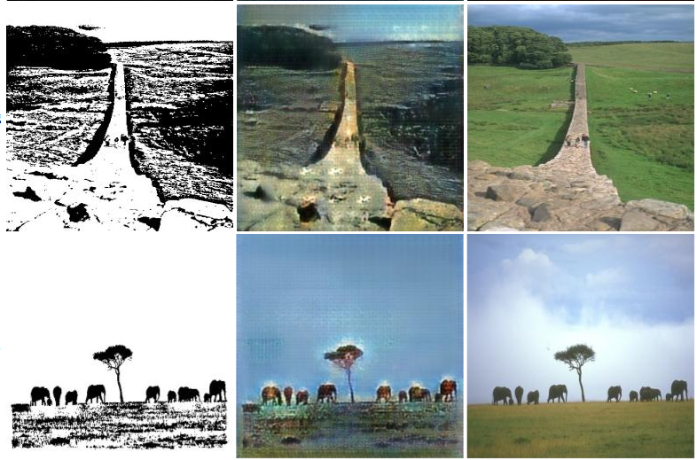
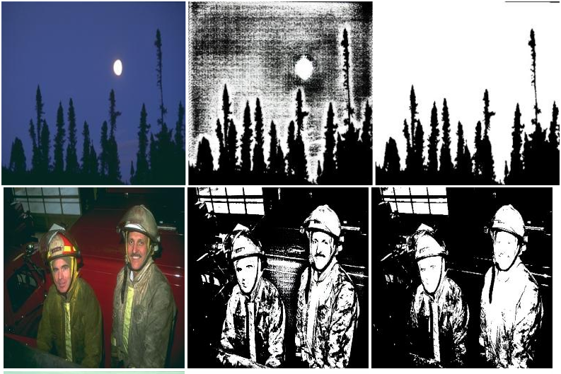
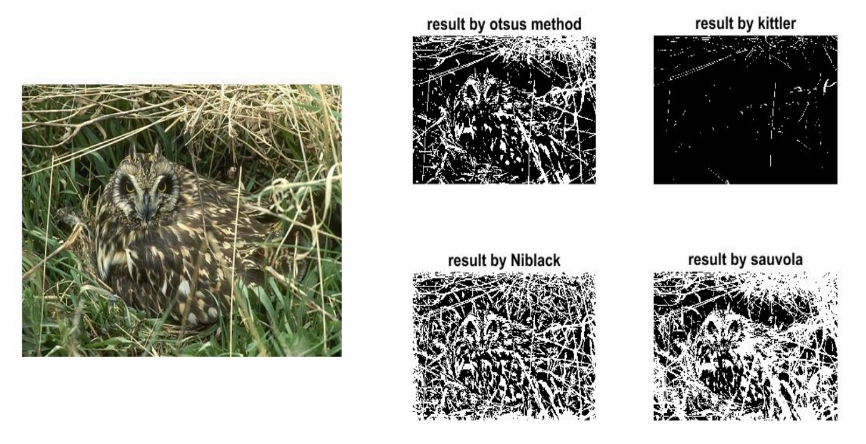

# Binary to Color and Color to Binary
Most of us have observed the power of generalizaton of gan from works like [pix2pix](https://phillipi.github.io/pix2pix/). In their work pix2pix had tried edges to photo(like binary to color) but showed it on cases like bags and cats but here we tried it in broader way i.e., from Binarized Images to Color Images.Some examples are shown here below:-

## Binary to Color
Left Image is Binarized Image

Middle Image is binary to color networks output

Right Image is Ground Truth



## Color to Binary
Left Image is Color Image

Middle Image is color to binary networks output

Right Image is Ground Truth


# Dataset Preperation
Moving forward we prepared the dataset for this problem by using voting technique for every pixel by Otsu's, Kittler, Niblack and Sauvola binarized images.Original Images are taken from BSDS300.



# PPT
[PPT link](https://docs.google.com/presentation/d/1uckg2aGYa0CYTAebEwhDBK-SN_tRwsl0UuziH4Ez0LA/edit?usp=sharing) 

## Setup

### Prerequisites
- Linux or OSX
- NVIDIA GPU + CUDA CuDNN (CPU mode and CUDA without CuDNN may work with minimal modification, but untested)

### Getting Started

Binary to Color A->B

Color to Binary B->A

#### Installation Prerequisites
- Install torch and dependencies from https://github.com/torch/distro
- Install torch packages `nngraph` and `display`
```bash
luarocks install nngraph
luarocks install https://raw.githubusercontent.com/szym/display/master/display-scm-0.rockspec
```

#### Dataset
Unzip the files in binarization folder.
``` bash
python scripts/combine_A_and_B.py --fold_A datasets/binarization/A --fold_B datasets/binarization/B --fold_AB datasets/binarization
```
#### Train
- Train the model from A to B
```bash
DATA_ROOT=datasets/binarization name=binary_color which_direction=AtoB th train.lua
```

#### Test
```bash
DATA_ROOT=datasets/binarization name=binary_color which_direction=AtoB phase=val th test.lua
```
### Pretrained models
For pretrained models you can look at [checkpoint](https://github.com/KonkimallaChandraPrakash/pix2pix/tree/master/checkpoints)

# Acknowledgements
Code borrows heavily from Image-to-Image Translation with Conditional Adversarial Networks ([pix2pix](https://phillipi.github.io/pix2pix/))
